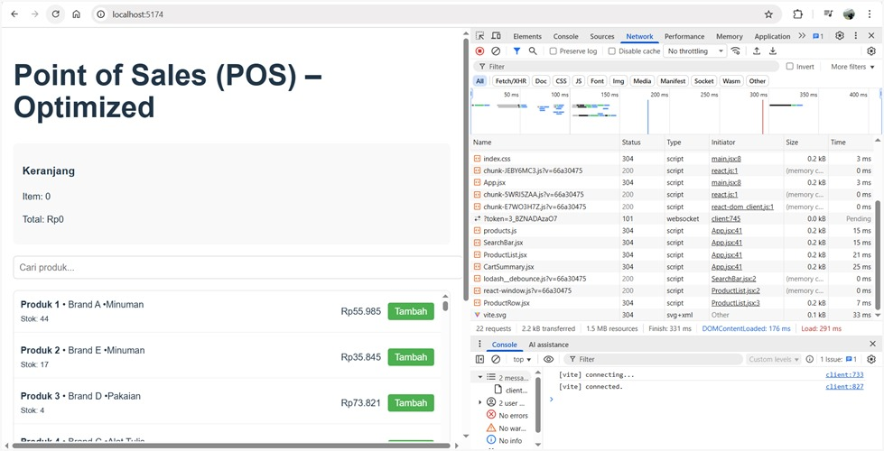
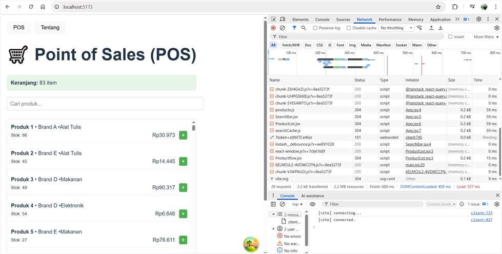
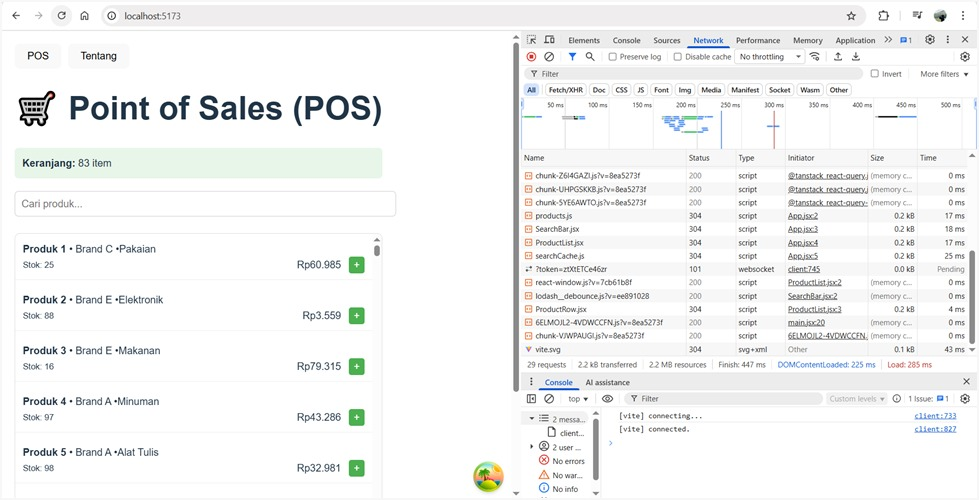

# Laporan Praktikum React Query
# Rafa Ayu Radhyafitri - V3424068

## 1. Tujuan
Menguji peningkatan performa aplikasi setelah mengimplementasikan React Query untuk manajemen data dan caching otomatis, serta membandingkannya dengan metode manual yang tidak menggunakan caching.

## 2. Hasil Pengujian Waktu Respons
Pengujian dilakukan menggunakan Chrome DevTools (tab Network) dengan memantau waktu respons pada file `products.js`.

| Kondisi                     | Deskripsi                           | Waktu Respons (kolom "Time") | Keterangan                               |
|-----------------------------|-------------------------------------|-------------------------------------------------------------------------|
| Tanpa React Query           | Fetch manual tanpa cache            | ±320 ms                       | Selalu melakukan request baru keserver  |
| React Query - Refresh 1     | Fetch awal dan menyimpan ke cache   | ±75 ms                        | Cache dibuat pertamakali                |
| React Query - Refresh 2     | Tidak ada request baru, dari cache  | ±0–10 ms                      | Cache hit: data langsung darimemori     |

Kesimpulan awal: Penggunaan React Query menurunkan waktu respon dan meningkatkan efisiensi aplikasi secara signifikan.

## 3. Screenshot Pengujian

### Gambar 1 – Tanpa React Query
  
Setiap kali refresh, file products.js selalu di-fetch ulang. Tidak ada cache.

### Gambar 2 – React Query (Refresh Pertama)
  
React Query melakukan fetch pertama kali dan menyimpan hasil ke cache.

### Gambar 3 – React Query (Refresh Kedua / Cache Hit)
  
Tampilan Network menunjukkan tidak ada fetch baru. Data diambil dari cache memori.

## 4. Cara React Query Mengelola Cache Secara Otomatis
React Query mengatur caching data secara internal di memori aplikasi menggunakan queryKey unik.

- Saat useQuery() dijalankan, React Query memanggil fungsi fetch dan menyimpan hasilnya.
- Jika komponen dirender ulang atau halaman di-refresh:
  - Jika data masih fresh (belum melewati staleTime), React Query langsung menampilkan data dari cache (cache hit).
  - Jika stale, React Query akan melakukan refetch otomatis di background tanpa menunggu pengguna.
- Data lama otomatis dihapus setelah cacheTime berakhir.

Dengan mekanisme ini, React Query mengurangi beban request ke server dan meningkatkan efisiensi aplikasi.

## 5. Perbandingan React Query vs Custom Cache

| Aspek                   | Custom Cache (manual)                  | React Query                            |
|-------------------------|----------------------------------------|----------------------------------------|
| Penyimpanan             | Manual (pakai Map atau localStorage)   | Otomatis di memori                     |
| Validasi Data           | Harus dibuat manual                    | Otomatis lewat staleTime dan cacheTime |
| Refetch Otomatis        | Tidak ada                              | Ada, di background                     |
| Monitoring Cache        | Tidak tersedia                         | React Query DevTools                   |
| Kemudahan Implementasi  | Kompleks                               | Sederhana dan efisien                  |

## 6. Apakah Cache Membuat Aplikasi Lebih Baik?
Ya, sangat membantu.

Kelebihan cache menggunakan React Query:
- Mengurangi waktu loading dari ±320 ms menjadi ±10 ms.
- Tidak perlu request berulang, sehingga lebih hemat bandwidth.
- Menjaga UI tetap responsif.
- Sinkronisasi data otomatis lewat mekanisme staleTime dan refetch.

Kesimpulan: Cache React Query sangat ideal untuk performa jangka pendek (di memori). Jika ingin data tetap tersedia setelah browser ditutup, baru dipertimbangkan localStorage.

## 7. Kesimpulan Akhir
Mengimplementasikan React Query dapat meningkatkan kecepatan, efisiensi, dan stabilitas aplikasi. Dengan adanya caching otomatis dan mekanisme invalidasi yang cerdas, pengembang tidak perlu menulis logika caching sendiri. Pengujian menunjukkan bahwa performa aplikasi yang menggunakan React Query jauh lebih baik dibandingkan versi yang tidak menggunakan caching.